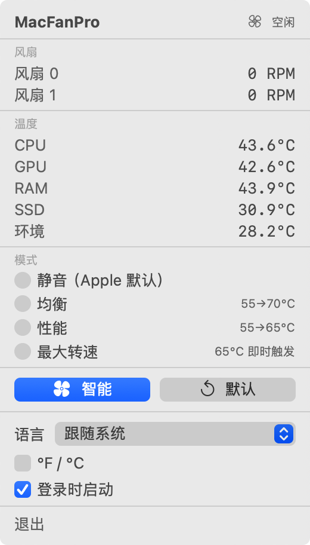

# MacFanPro

[](https://github.com/macfanpro/macfanpro/actions/workflows/ci.yml)
[](https://github.com/macfanpro/macfanpro/releases/latest)
[](LICENSE)

面向 Apple Silicon Mac 的免费开源风扇控制工具，在菜单栏查看温度和转速，按温度自动调节风扇，也可通过命令行控制和记录数据。

MacFanPro 基于 [ThermalForge](https://github.com/ProducerGuy/ThermalForge) 独立维护，使用自己的版本、安装名称和更新渠道，并非上游官方发行版。

[安装](#安装) · [使用](#使用) · [更新](#更新) · [卸载](#卸载) · [日志与数据](#日志与数据) · [常见问题](#常见问题) · [开发与贡献](#开发与贡献)

## 功能与界面

- **温度与转速监测**：查看 CPU、GPU、内存、SSD、环境温度及各风扇实际转速，具体读数取决于机型提供的传感器。
- **自动风扇控制**：提供智能、静音、均衡、性能和最大转速模式，也可恢复 Apple 自动控制。
- **原生菜单栏界面**：弹窗高度随内容调整；温度标签按“图标＋两位数字＋°”预留最小宽度，内容整体居中，三位数时扩展。
- **语言与显示设置**：支持英语、简体中文、繁体中文、跟随系统、摄氏/华氏切换及登录时启动。
- **命令行与后台服务**：支持指定转速、读取状态和 CSV 数据采样；正常安装后，应用和普通控制命令通过后台服务操作风扇。

下面是本机运行 MacFanPro 0.2.3.15 的真实截图（简体中文）：



## 系统要求

- Apple Silicon Mac，macOS 14 或更高版本；不支持 Intel Mac。
- 风扇控制需要带风扇的机型，无风扇机型无法使用该功能。
- 首次安装或更新后台服务需要管理员权限；Homebrew 和源码安装还需要 Xcode 16 或更高版本。

当前实机验证以 M4 Max MacBook Pro 为主。其他机型、macOS 版本和显示环境不应视为已验证，具体范围见 [0.2.3.15 验证记录](docs/macfanpro-0.2.3.15-validation.md)。

## 安装

以下三种方式**选择一种即可，不需要依次执行**。如果 MacFanPro 已在运行，请先在菜单中点击“退出”。

| 安装方式 | 适合场景 | 是否需要本机编译 |
| --- | --- | --- |
| Homebrew | 使用 Homebrew 安装和管理版本 | 是，需要 Xcode |
| 下载发行包 | 直接使用已编译的应用和 CLI | 否，无需 Xcode |
| 源码构建 | 修改代码、调试或自行构建 | 是，需要 Xcode |

### 方式一：通过 Homebrew 安装

前提：已安装 [Homebrew](https://brew.sh/zh-cn/) 和 Xcode 16 或更高版本。目前配方在本机从源码构建。

在终端中依次执行：

```bash
brew tap macfanpro/tap
brew trust macfanpro/tap
brew install macfanpro
sudo "$(brew --prefix macfanpro)/bin/macfanpro" install
open /Applications/MacFanPro.app
```

Homebrew 7 起默认不加载第三方 tap 的配方，需要先用 `brew trust` 明确信任本 tap（只需一次）。Homebrew 负责下载、编译和管理版本；`sudo` 那条命令将对应版本的应用和后台服务安装到系统中。配方维护在 [macfanpro/homebrew-tap](https://github.com/macfanpro/homebrew-tap)。

### 方式二：下载发行包安装

此方式无需安装 Homebrew 或 Xcode。

1. 前往 [Releases](https://github.com/macfanpro/macfanpro/releases/latest)，下载 `MacFanPro-版本号-macos-arm64.tar.gz`。请选择这个发行包，而非 GitHub 自动生成的 `Source code` 源码包。
2. 双击解压，保留文件夹内的 `MacFanPro.app` 和 `bin` 目录。
3. 在终端中进入解压后的文件夹，执行安装并打开应用。

例如，`0.2.3.15` 解压在“下载”目录时：

```bash
cd ~/Downloads/MacFanPro-0.2.3.15-macos-arm64
sudo ./bin/macfanpro install
open /Applications/MacFanPro.app
```

其他版本或下载位置，请相应替换文件夹路径。安装成功后，可以删除压缩包和解压文件夹。

仅将 `MacFanPro.app` 拖入“应用程序”目录，无法完成后台服务安装。当前发行包使用 ad-hoc 签名，尚未经过 Apple 公证，首次运行可能出现 macOS 安全提示，见[常见问题](#常见问题)。

### 方式三：从源码构建安装

前提：已安装 Xcode 16 或更高版本。

```bash
git clone https://github.com/macfanpro/macfanpro.git
cd macfanpro
./setup.sh
```

`setup.sh` 会编译源码、组装应用、请求管理员权限完成安装，并打开 MacFanPro，无需再执行其他安装命令。

此方式默认构建仓库的 `main` 分支，可能包含尚未发行的修改。如需构建指定发行版，可在运行 `./setup.sh` 前执行 `git checkout v0.2.3.15`，版本号按需替换。

### 安装完成后

应用安装在 `/Applications/MacFanPro.app`，打开后显示在菜单栏中，不显示 Dock 图标。需要登录后自动运行时，在应用中勾选“登录时启动”。

终端输入管理员密码时不会显示字符，输入完成后按回车即可。应用与已安装后台服务配合工作，日常使用无需重复输入密码。

## 使用

### 菜单栏控制

点击菜单栏风扇图标打开控制面板，查看传感器读数并选择模式。

| 模式或按钮 | 行为 |
| --- | --- |
| 静音（Apple 默认） | 常规温度下交由 Apple 自动控制，并非强制关闭风扇 |
| 均衡 | 根据温度逐步提高转速，采用较缓和的响应曲线 |
| 性能 | 更快响应温度上升，允许更高的目标转速 |
| 最大转速 | 达到温度及持续时间触发条件后使用最高转速，并非始终全速 |
| 智能 | 根据温度及变化趋势调节转速；有有效校准数据时结合使用，无需先校准也能运行 |
| 默认 | 取消当前接管并恢复 Apple 自动控制 |

高温保护逻辑可能覆盖当前模式。

菜单中还可切换语言、温度单位及登录时启动。繁体中文使用与简体中文相同的表述，仅转换字形。

### 常用命令

以下命令按需要单独执行。正常安装且后台服务运行时，表中的命令无需 `sudo`。

| 命令 | 用途 |
| --- | --- |
| `macfanpro --version` | 查看当前 CLI 版本 |
| `macfanpro status` | 以 JSON 输出风扇转速和温度 |
| `macfanpro max` | 立即将所有风扇设为最大转速 |
| `macfanpro set 3000` | 请求将所有风扇设为 3000 RPM，实际值受硬件范围限制 |
| `macfanpro set 3000 --fan 0` | 仅设置索引为 0 的风扇 |
| `macfanpro auto` | 恢复 Apple 自动控制，保留菜单栏应用运行 |
| `macfanpro auto --stop-app` | 退出菜单栏应用并恢复 Apple 自动控制 |
| `macfanpro log --duration 60s` | 采集 60 秒传感器数据并保存为 CSV |
| `macfanpro --help` | 查看全部命令；单个命令可追加 `--help` |

`max` 和 `set` 会建立终端持有的转速设置，应用会显示相应提示并暂停自己的调节。点击“默认”、重新选择模式或运行 `macfanpro auto` 可以取消该设置。仅退出菜单栏应用不会取消终端持有的转速。

`macfanpro auto` 不关闭应用；应用中的自动模式仍可能再次接管。需要完全交回 macOS 时，使用 `macfanpro auto --stop-app`。

高级命令 `watch` 会按模式持续控制风扇，并非只读监测；`calibrate` 会运行负载并改变风扇转速。这两项操作需要管理员权限，使用前请阅读各自的 `--help`，它们不是日常使用的必需步骤。

## 更新

应用内的更新提示仅检查本仓库的发行版，不会自动替换程序。请沿用原安装方式更新，并在替换后台服务前退出应用。

### Homebrew 更新

```bash
brew update
brew upgrade macfanpro
macfanpro auto --stop-app
sudo "$(brew --prefix macfanpro)/bin/macfanpro" install
open /Applications/MacFanPro.app
```

`brew upgrade` 更新 Homebrew 中的文件，随后仍需同步后台服务和 `/Applications` 中的应用。如果 Homebrew 提示 `untrusted tap`，先执行一次 `brew trust macfanpro/tap`。使用 `brew --prefix` 指向刚升级的版本，避免误用旧的系统副本。

### 发行包更新

下载并解压新版本，退出正在运行的应用，然后进入**新版本的解压目录**，重新执行发行包安装步骤。安装器会替换应用和后台服务，不需要先卸载，用户数据会保留。

### 源码更新

若按前文克隆了 `main` 分支，先保存自己的代码修改、退出应用，再在源码目录执行：

```bash
git pull --ff-only
./setup.sh
```

若之前检出了指定版本标签，请先 `git fetch origin --tags`，再检出需要的新标签并运行 `./setup.sh`。

## 卸载

移除应用、命令行工具和后台服务，同时保留用户数据：

```bash
sudo macfanpro uninstall
```

如需同时删除当前用户的模式文件、校准数据、采样记录和运行日志，请**改用**：

```bash
sudo macfanpro uninstall --purge-data
```

如果通过 Homebrew 安装，完成上述卸载后，还需执行：

```bash
brew uninstall macfanpro
```

`--purge-data` 清理当前用户的 `~/Library/Application Support/MacFanPro/` 和 `~/Library/Logs/MacFanPro/`；不会删除自定义导出目录、root 用户的日志目录或单独保存的界面偏好。仅拖走 App 或仅运行 `brew uninstall` 不会完成后台服务卸载。

## 日志与数据

运行日志和手动采样数据使用不同的保留策略：

| 数据 | 默认位置 | 保留策略 |
| --- | --- | --- |
| 应用运行日志 | `~/Library/Logs/MacFanPro/` | 最多 7 个自然日（含当天），单文件最多 5 MiB，目录内受管理日志合计最多 50 MiB |
| 后台服务运行日志 | `/var/root/Library/Logs/MacFanPro/` | 与应用运行日志相同，独立计算容量与保留时间 |
| 临时 CSV 采样 | `~/Library/Application Support/MacFanPro/logs/` | 每次采样的 CSV 最多 100 MiB，正常结束后保留 24 小时 |
| 模式与校准数据 | `~/Library/Application Support/MacFanPro/` | 不会按日志策略自动清理 |

运行日志在启动、写入及运行期间每小时清理；两处受管理的运行日志默认容量合计最多 100 MiB。磁盘写入失败时会暂停文件日志并稍后重试，待写队列有容量限制。

临时采样达到容量上限时停止并保留已有数据。正常结束、Ctrl-C 或 SIGTERM 后更新到期时间；异常退出也会留下可清理标记。应用启动、运行期间每小时及下一次采样启动时，会清理已到期且不再写入的采样目录。应用未运行时，用户的采样文件会保留到下一次清理。

**采样的 100 MiB 限制针对每次记录，不是整个采样目录的总容量。** 使用 `--output <目录>` 或 `--no-expire` 的采样会永久保留且没有该容量限制，需自行管理。未标记到期时间的旧采样和其他文件不会自动删除。

## 常见问题

### 提示后台服务不可用或版本不一致

应用、CLI 和后台服务需要来自同一版本。先退出应用，再按原安装方式重新执行安装或同步步骤：Homebrew 用户使用配方中的 CLI，发行包用户使用解压目录内的 `./bin/macfanpro`。完成后重新打开应用；若仍失败，请保留终端错误和对应时段日志以便排查。

### 下载后提示无法验证开发者

当前发行包尚未经过 Apple 公证。如果确认文件来自本仓库且未遭篡改，可按照 [Apple 官方说明](https://support.apple.com/zh-cn/102445)，在尝试打开后前往“系统设置 → 隐私与安全性”查看“仍要打开”选项。

发行页提供 `SHA256SUMS`。将它与压缩包放在同一目录，可运行 `shasum -a 256 -c SHA256SUMS` 核对下载完整性；校验和不等同于 Apple 公证。

### 温度或风扇读数与其他机器不同

不同机型提供的传感器、风扇数量及转速范围可能不同。提交问题时，请附上机型、macOS 版本、MacFanPro 版本、安装方式、复现步骤，以及相关状态输出或日志片段。问题反馈入口：[Issues](https://github.com/macfanpro/macfanpro/issues)。

### 温度与 Stats 等工具不一致

MacFanPro 的 CPU、GPU 行显示对应传感器中的**最高值**，可与 Stats 的“Hottest CPU / Hottest GPU”对照，不要与“Average”对照。在 M4 系列上，CPU 行使用与 Stats 相同的核心传感器；其他芯片按传感器前缀分组，可能与其他工具的选择不同。风扇控制和 95°C 安全阈值跟随芯片最热点（包括不在 CPU 行显示的热点传感器），因此风扇可能在 CPU、GPU 行都未到阈值时开始提速。对照方法与实测数据见 [传感器校准记录](docs/thermal-sensor-calibration-20260924.md)。

## 开发与贡献

### 项目结构

| 路径 | 内容 |
| --- | --- |
| [`Sources/MacFanProApp/`](Sources/MacFanProApp/) | SwiftUI 菜单栏应用、界面状态和交互 |
| [`Sources/MacFanProCore/`](Sources/MacFanProCore/) | SMC 访问、风扇控制、后台通信、模式与日志 |
| [`Sources/MacFanProLocalization/`](Sources/MacFanProLocalization/) | 语言选择和翻译资源 |
| [`Sources/macfanpro/`](Sources/macfanpro/) | CLI、应用组装、安装与卸载入口 |
| [`Tests/MacFanProTests/`](Tests/MacFanProTests/) | 自动化测试 |
| [`Scripts/`](Scripts/) | 测试、语言资源校验与发行打包脚本 |

### 构建与验证

在仓库根目录执行：

```bash
swift build
bash Scripts/test.sh
bash Scripts/test.sh -c release
bash Scripts/check-localization-package.sh
```

这些命令构建和测试项目，不执行安装流程。`Scripts/test.sh` 按顺序运行 Swift 测试及客户端断连检查；CI 也覆盖 Debug、Release 和语言资源打包验证。

本地生成发行包：

```bash
bash Scripts/package-release.sh
```

产物输出到 `dist/`，包括完整应用与 CLI 的 `.tar.gz` 和 `SHA256SUMS`。打包不会替换本机已安装的应用；需要安装开发版本时再运行 `./setup.sh`。

提交 [Pull Request](https://github.com/macfanpro/macfanpro/pulls) 时，请说明具体问题、改动范围和验证结果。涉及温控、后台通信或原生菜单行为的修改，应补充对应的本机验证，并区分自动化测试、隔离显示测试和真实硬件结果。

### 文档与维护约定

- [更新记录](CHANGELOG.md)：已发行版本的主要变化。
- [发布说明规范与模板](docs/releases/README.md)：按版本维护发布说明、下载入口、升级提示和验证依据。
- [0.2.3.15 验证记录](docs/macfanpro-0.2.3.15-validation.md)：发行产物、本机运行和未覆盖环境。
- [0.2.3.16 验证记录](docs/macfanpro-0.2.3.16-validation.md)：温度传感器修正与 Stats 对照（本机候选版，尚未发行）。
- [相对上游的温度改动](docs/upstream-divergence.md)：合并上游时需要重新施加的改动。
- [GUI 本地化](docs/gui-localization.md)：英语键名、简体翻译、繁体字形转换及资源校验流程。
- [菜单栏标签验证](docs/menu-bar-label-validation.md)：最小宽度、位数变化和隔离显示测试。
- [M4 风扇接管修复](docs/m4-handoff-repair.md)：相关硬件行为与修复依据。

`docs/upstream/` 和早期验收文档用于保存历史背景，不代表当前发行版或所有机型的测试结论。

版本号采用 **上游版本号 + 第四段修订号**，由 [`Version.swift`](Sources/MacFanProCore/Version.swift) 定义。例如 `0.2.3.15` 基于上游 `0.2.3`；只有实际合入新的上游版本后才更新前三段。应用和 CLI 按各段数字比较版本，缺省段视为 0，不为特定旧版添加比较例外。

## 来源与许可

MacFanPro 由 hongyukeji 维护，遵循 [MIT License](LICENSE)。项目完整保留 ThermalForge 上游版权与许可，衍生关系及第三方依赖说明见 [NOTICE.md](NOTICE.md) 和 [ThirdPartyNotices/](ThirdPartyNotices/)。
