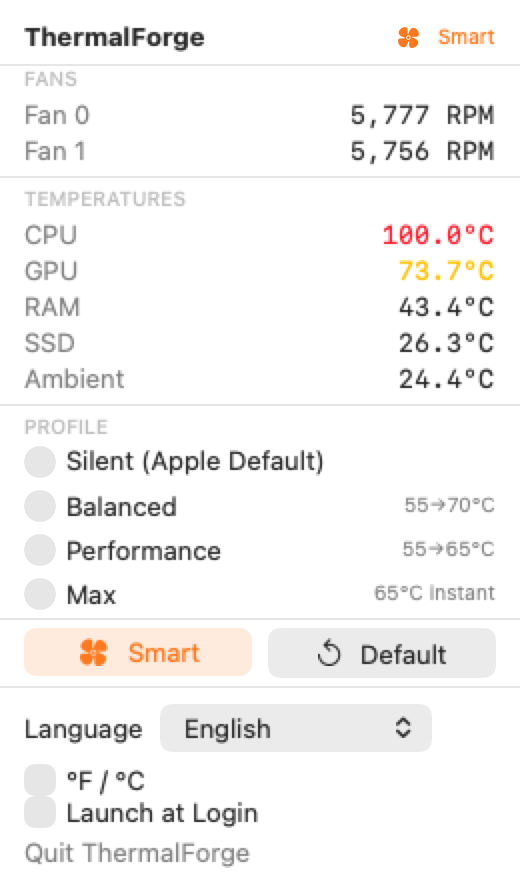
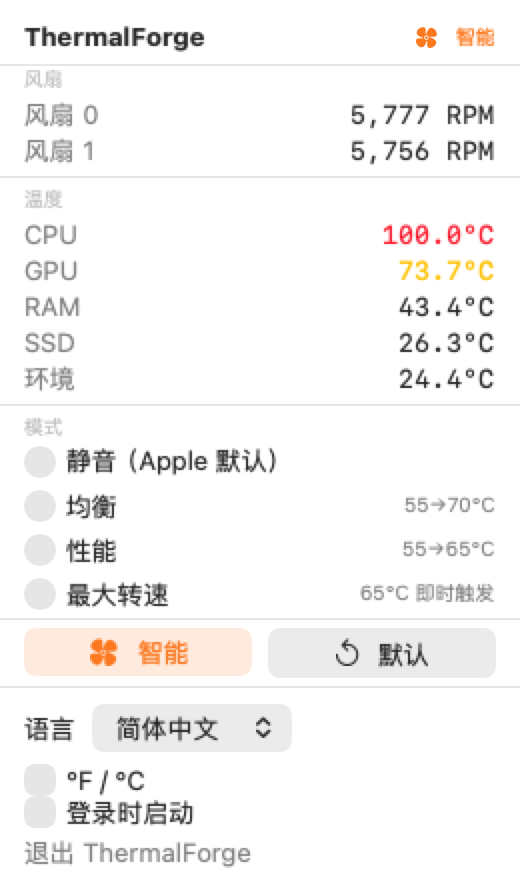
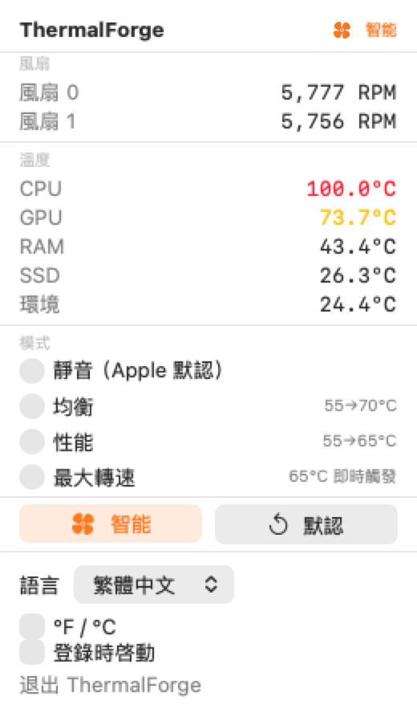

# GUI localization

The menu bar app supports English (`en`), Simplified Chinese (`zh-Hans`) and Traditional Chinese (`zh-Hant`). The Language picker defaults to Follow System, resolves the first supported entry in the ordered system language list, and falls back to English. Explicit selections persist as `guiLanguage`; switching updates the retained SwiftUI view without rebuilding AppState, restarting its monitor or changing fan commands. Unknown, missing, empty or malformed individual translations fall back to the English source text.

## Adding or updating copy

1. Keep the official English copy as the `language.text(...)` key. Add the same key/value to `Sources/ThermalForgeLocalization/Resources/en.json`.
2. Translate `zh-Hans.json`. Keep named placeholders such as `{version}` and `{rpm}` unchanged. Dynamic values are substituted once and remain literal.
3. Run `swift Scripts/update-traditional.swift` from the repository root. Traditional Chinese is exactly the same wording converted with Foundation's `Simplified-Traditional` transform; do not add regional vocabulary or rewrite meanings.
4. Run `swift test` and `bash Scripts/check-localization-package.sh`. The tests check key/token completeness, exact script conversion, language preference ordering, English fallback, isolated preference persistence and retained panel rendering in every language and warning state.

Profile IDs, commands, daemon protocol fields, JSON, CLI help, log text and numeric formats remain upstream contracts. Translate only their GUI presentation. The localization module has no dependency on ThermalForgeCore. The `AppState(startServices: false)` hook exists only for offscreen presentation tests; production initialization and actions use the upstream path.

## Packaging and maintenance

`swift build` creates `ThermalForge_ThermalForgeLocalization.bundle` beside the app executable. The shared `thermalforge build-app` assembler, including the path used by `setup.sh`, validates and copies it into `Contents/Resources`. Binary distributions must include that adjacent bundle, pass `--localization-resources`, or ship the already assembled app. Missing/invalid resources fail before replacing an existing destination. CI checks both correct copying and that failure path.

At runtime a packaged app loads its own resource bundle, never a SwiftPM build-machine fallback. If installed resources cannot be read, English source text remains available. The app declares English as its development region and all three supported localizations. Sign the completed app after assembly, so resource signatures cover the translations.

When updating the interface, preserve control behavior and layout. Wrap new GUI copy, extend the English/Simplified tables, regenerate Traditional, and repeat the tests and packaging check. Existing original English text is still readable while a translation is pending.

## Preview

Offscreen renderings on macOS 27 use synthetic temperatures and RPM to exercise wide values; they are presentation fixtures, not hardware measurements.

| English | Simplified Chinese | Traditional Chinese |
| --- | --- | --- |
|  |  |  |
